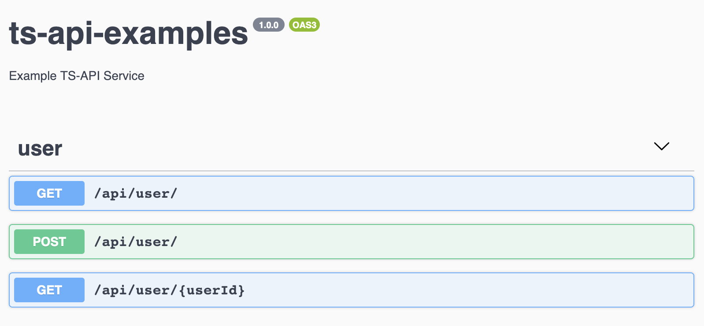

# TS-API

APIs in NodeJS should have a single source of truth for api specs between code and docs, as well as compile time type safety.  

Schemas are often duplicated between json schemas for input validation, typescript types, jsdoc comment annotations or  swagger-specific wrappers in your app.  Routes and response status codes also suffer from similar issues where code can get out of sync with documentation.

TS-API solves this by leveraging the typescript parser to generate:

* OpenAPI (Swagger) docs
* Runtime type checks with Json schemas
* ExpressJS routes to be mounted
* Optional correctness verification of status code <-> result type mapping

## Concepts

### Type conversion

TypeScript types are extracted from the source code, such as this example:

```javascript
export interface User {
    name: string;
    isActive?: boolean;
}
```

is converted to a json schema:

```json
  "User": {
    "type": "object",
    "properties": {
      "name": {
        "type": "string"
      },
      "isActive": {
        "type": "boolean"
      }
    },
    "required": [
      "name"
    ]
  }
```

### Route Generation

```javascript
@controller('/user')
export class User extends ControllerBase {

  @get('/')
  async listUsers(): Promise<User[]> {
  ...
  return [{ ...account1 }, ...]
  }
```

The controller and Rest verbs (get, post, put, etc.) optionally take a route override, otherwise it uses the class or method name by default.

A router tree is build by TS-API from all controllers in the typescript path:

```javascript
AccountRouter.get('/', async(req,res,next) => { ... }
```

You can mount this anywhere in your app, use middleware, and treat it like any other ExpressJS router.  The controller gives full access to req/res/next in the constructor.  There's further customizations support, such as hooks to customize input validation, but by default it returns a `400` status.

### OpenAPI (Swagger) docs

OpenAPI 3 output for a sample controller:



[ReDoc](https://github.com/Rebilly/ReDoc) is also supported as viewer.

## Usage

### Install

    npm install --save-dev ts-api

First make this package a dependency.  This will provide the necessary decorators *@controller*,
*@router* *@get* *@post*, etc.  The analyzer will search for those names and generate code that
uses them, but these decorators also do things themselves like invoke the runtime type checker.

### Create appropriately annotated classes and methods.

The key steps are:

1. Create a class that extend the base controller 
2. Add a controller decorator to the class
3. Decorate methods that represend API endpoints 
4. Use typescript interfaces for type declarations in the method arguments/response

See an [example controller](examples/src/controllers/user.ts) for a working reference.

### Import the router and use in your app

```javascript
@router('/api')
export default class Router extends RouterBase {
  constructor(app: any) {
    super(app);
    require('./__routes')(this);
  }
}
```

### Run cg after typescript compiling your code

The easiest way to do this is an npm script (or npm install -g):

    tsc && cg
    
The `cg` CLI tool can take options and specific files:

    cg <options> <list of files>
   
### Run your app

You can verify output by using the hosted docs.  The route will depend on where you mount the app, such as:

http://localhost:3002/api/docs
 
## License

[Apache 2.0](LICENSE)    
